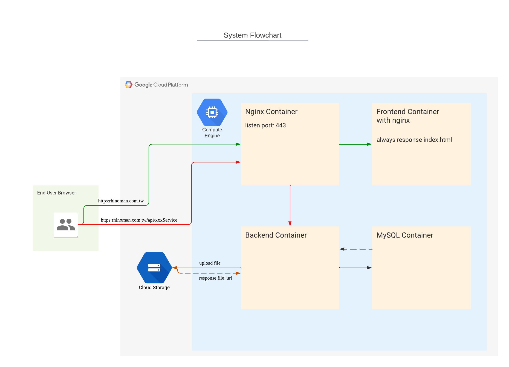
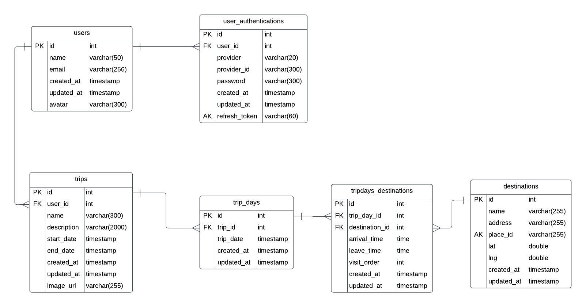
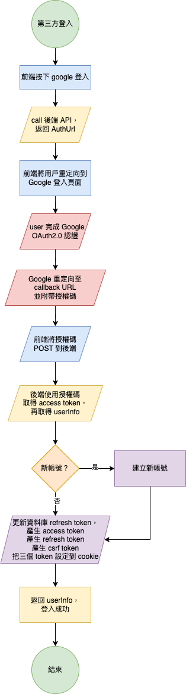
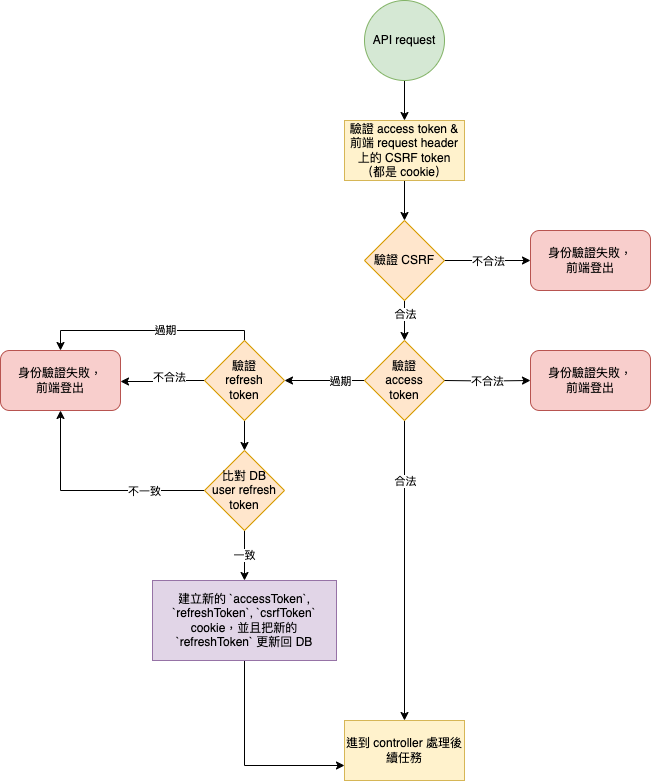

# travel_note_frontend

### 主要功能

- google 第三方登入、上傳/編輯頭照。
- 新增主行程，可上傳主行程照片。
- 輸入名稱搜尋目的地，透過 google map api 取得該地點詳細資訊，並顯示於畫面。
- 搜尋到目的地資訊後，可點擊加入行程，並設定開始與結束時間。
- 透過 google map api 計算行程之間的車程時間並顯示於畫面。
- 可以透過 GPT input 輸入地點，讓 AI 規劃目的地（回應時間比較長）。
- 設定連結參數，點擊 google 導航行程連結，會將當日行程地點帶到 google map，可進行導航。

### System Flowchart

### DB ER Diagram

### Google Login

### Authentication process

